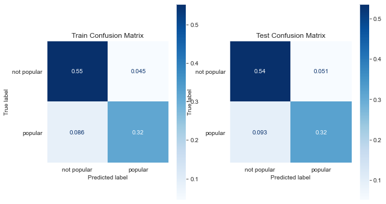

# Popular Audio Features

Myrna Grace Calip

## Overview
Use predictive analysis on what makes a song popular based on Spotify's audio features based on the data chosen. 

Models Performed:
- Logistic Regression
- Decision Tree Classifier
- Random Tree Classifier
- XGBoost

The metrics used to evalute how well the model performed were based on their classification report, ROC and AUC.

## Business Problem
Popular music streaming platforms such as Youtube, Spotify, and SoundCloud has made it easier for musicians of all types to upload music content and share it instantly with audiences world wide. Yet, as a musician it is hard to get your music heard let alone become a top hit. Our analysis offers record labels, artists, and producers determine what qualities they should consider when releasing music on streaming platforms based on Spotify's audio features provided from the given [Data](https://www.kaggle.com/vicsuperman/prediction-of-music-genre). 

Our goal is to answer the following questions:

* Which audio features makes an impact on a song's popularity?
* What genre should a record label prioritize when finding an artist?
* Does music theory features contribute to their popularity?

## Understanding the Data

### Spotify's Audio Features

Below are the meaning behind Spotify's Audio Features based on their Web API audio features reference.

* **popularity**: The popularity of the track. The value will be between 0 and 100, with 100 being the most popular. The popularity of a track is a value between 0 and 100, with 100 being the most popular. The popularity is calculated by algorithm and is based, in the most part, on the total number of plays the track has had and how recent those plays are. Generally speaking, songs that are being played a lot now will have a higher popularity than songs that were played a lot in the past. Duplicate tracks (e.g. the same track from a single and an album) are rated independently. Artist and album popularity is derived mathematically from track popularity.

* **acousticness**: A confidence measure from 0.0 to 1.0 of whether the track is acoustic. 1.0 represents high confidence the track is acoustic.

* **danceability**: Danceability describes how suitable a track is for dancing based on a combination of musical elements including tempo, rhythm stability, beat strength, and overall regularity. A value of 0.0 is least danceable and 1.0 is most danceable.

* **duration_ms**: The duration of the track in milliseconds.

* **instrumentalness**: Predicts whether a track contains no vocals. "Ooh" and "aah" sounds are treated as instrumental in this context. Rap or spoken word tracks are clearly "vocal". The closer the instrumentalness value is to 1.0, the greater likelihood the track contains no vocal content. Values above 0.5 are intended to represent instrumental tracks, but confidence is higher as the value approaches 1.0.

* **key**: The key the track is in. Integers map to pitches using standard Pitch Class notation. E.g. 0 = C, 1 = C♯/D♭, 2 = D, and so on. If no key was detected, the value is -1.

* **liveness**: Detects the presence of an audience in the recording. Higher liveness values represent an increased probability that the track was performed live. A value above 0.8 provides strong likelihood that the track is live.

* **loudness**: The overall loudness of a track in decibels (dB). Loudness values are averaged across the entire track and are useful for comparing relative loudness of tracks. Loudness is the quality of a sound that is the primary psychological correlate of physical strength (amplitude). Values typically range between -60 and 0 db.

* **mode**: Mode indicates the modality (major or minor) of a track, the type of scale from which its melodic content is derived. Major is represented by 1 and minor is 0.

* **speechiness**: Speechiness detects the presence of spoken words in a track. The more exclusively speech-like the recording (e.g. talk show, audio book, poetry), the closer to 1.0 the attribute value. Values above 0.66 describe tracks that are probably made entirely of spoken words. Values between 0.33 and 0.66 describe tracks that may contain both music and speech, either in sections or layered, including such cases as rap music. Values below 0.33 most likely represent music and other non-speech-like tracks.

* **tempo**: The overall estimated tempo of a track in beats per minute (BPM). In musical terminology, tempo is the speed or pace of a given piece and derives directly from the average beat duration.

* **valence**: A measure from 0.0 to 1.0 describing the musical positiveness conveyed by a track. Tracks with high valence sound more positive (e.g. happy, cheerful, euphoric), while tracks with low valence sound more negative (e.g. sad, depressed, angry).

* **music_genre**: Alternative, Electronic, Rock, Anime, Jazz, Country, Blues, Classical, Rap, Hip-Hop

### Data Preparation
Before running our models, we need to preprocess our data to see if there are necessary data cleaning, dtype conversions, and feature engineering to be made.

### Popularity
- Convert dtype from float to int
- Set the target classifier 'popular_song': Popularity >= 50: 1 and Popularity < 50: 0
- Drop popularity column

### Tempo
- Drop missing tempos
- Convert dtype to float

### Duration_ms
- Drop tracks that have a value of -1.0 ms

### Mode
- Set Major:1, Minor:0
- Eventually we drop this feature

As a result from preprocessing we dropped 19% of our data.

## Data Visualization of Preprocessed Data

### Frequency of Popular songs

### Popularity Among the Genres

## Modeling & Evaluation
First we train test split the model to create a set of train and test data then One Hot Encode the object features (music_genre and key).
Once we create a processed train test split is created we are ready to build models.

- Logistic Regression
- Decision Tree
- Random Forest
- XGBoost

The model that performed the best is Decision Tree with Hyperparameter Tuning.

## Logistic Regression
Our first model will be logistic regression. Logistic regression's theory is similar to linear regression except it is transformed in a way that the outcome takes a value between 0 and 1. What our logistic model performs is predicting the probability that a song will be popular (P>50) or a song won't be popular (P<50)

Our Logistic Regression model was able to predict the non popular songs well but not the popular song so we moved on to our second model.

## Decision Tree
The second model we used are decision trees. Decision Trees looks at the data and classifies the data to 1 or more classes. It filters the data by certain features. The issue with this model is that it prone to overfitting as we can see on our classification report. To get a more accurate result we use GridSearch for Hyperparameter Tuning.

Our training accuracy score is 1 while our test accuracy score is .79 which is a sign of overfitting.

## Hyperparameter Tuning Decision Tree

Accuracy Score: .87

## Random Forest
Random Forest uses bagging and feature randomness when building each individual decision trees.

Accuracy Score: .86

## Hyperparameter Tuning Random Forest
There wasn't much a difference when tuning the random forest tree since it stuck with the basic parameters from our original random forest model.

Accuracy Score: .86 

## XGBoost
Extreme Gradient Boosting

Accuracy Score: .86

I opted to not tune our XGBoost model since our model performed well.

## Feature Importance

## ROC & AUC

The **Receiver Operating Characteristic (ROC)** is known for giving us a visual of the trade off between the **false positive** and **true positive rates**. While the Area Under Curve is the metric to compare the classes which is the summary to compare the ROC curve. 

AUC = 1 means that the classifier is able to perfectly distinguish all the Positive and Negative class points correctly. So our goal is the achieve a AUC closest to 1.

The AUC score for our Decision Tree Model is 0.7878777542642218
The AUC score for our Tuned Decision Tree Model is 0.8443624822952769
The AUC score for our Random Forest Tree Model is 0.8357209562284028
The AUC score for our Tuned Random Forest Tree Model is 0.83723003106272
The AUC score for our XGBoost Model is 0.8409138333759232

# Conclusion

Out of all the models that were trained, the final model that performed the best is our **Tuned Decision Tree Classifier**.  As we optimized the Decision tree the test accuracy score improved by 7 points. For AUC, the Decision Tree Classifier after optimizing the percentage increases by ~7% on detecting how well it was able to predict the popular songs from the false positive popular songs.

The reason we choose our Tuned Decision Tree's accuracy score of .87 as our metric because we want to know how well the model predicted the popular (true positive) and not popular (true negative) tracks overall. As for our Area Under the Curve it proved to have the highest percentage out of all the models.

**Reccomendations:**

Based on the Decision Tree's feature importance, record labels should focus on artists who specialize in genres like **Rock, Hip-Hop and Rap**  while prioritizing audio features such as **instrumentals, track duration, valence and loudness**. On the other hand, the key signature and the genre Jazz and EDM music does not play into a huge factor on a song's popularity. 

# Next Steps

- Iterate the missing feature information and scaping more audio features from Spotify's API to see if other audio features changes our predictions
- Scape data from other platforms such as BillBoard, SoundCloud, Apple Music and use classification models to compare their popular audio features
- Look into various Rock, Hip-Hop, and Rap artists to see who is the most popular based on scapring data from Spotify's API based on their popularity or follow count
